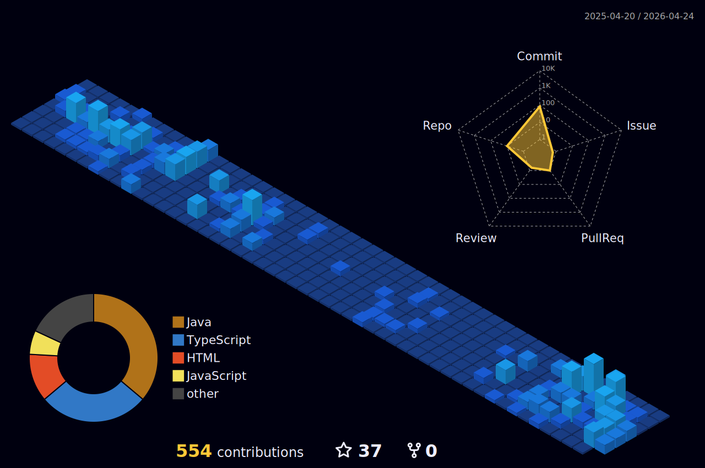

##👋 Olá! Eu sou Luan de Sordi Rebuli
Sou um desenvolvedor full stack apaixonado por programação desde cedo — comecei aos 10 anos explorando o mundo dos códigos com Minecraft em Java, e desde então a tecnologia se tornou meu caminho profissional.

  

   

  

 
##
   

     
  

  

 

